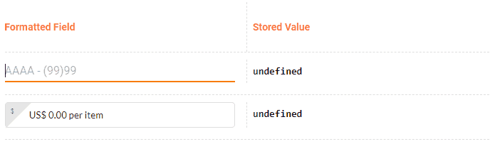

# redux-form-input-masks

<p align="center">
    <span>
        
    </span>
    <span>
        
    </span>
    <span>
        
    </span>
    <span>
        
    </span>
    <span>
        
    </span>
    <span>
        
    </span>
    <span>
        
    </span>
</p>

## [Documentation and examples](https://renato-bohler.github.io/redux-form-input-masks)

## [Migration guide](https://renato-bohler.github.io/redux-form-input-masks/#/migration-guide)

## Getting started

`redux-form-input-masks` is a library that works with [`redux-form`](https://github.com/erikras/redux-form) to easily add masking to `Field`s.

<div align="center">
    
</div>

## Motivation

Redux is awesome and so are input masks: they help standardizing inputs and improves the UX of the application. `redux-form` has support for input formatting, parseing and normalizing, but it can get pretty tricky to implement a mask with these functions. `redux-form-input-masks` offer simple APIs to create these masks so you don't need to worry about it!

Also, the value of the `Field`s in any application should be agnostic of how the `Field`s themselves are presented to the user. For example, if there's a currency field in a form, it makes more sense to store the value as a number. Storing `Field` values in a way that makes more sense for the application makes it easier to integrate form data with backend services and to create validations for it. With `redux-form-input-masks` you can also choose how the value of a formatted `Field` will be stored in the application's store.

## Under the hood

`redux-form-input-masks` returns objects implementing `redux-form`'s [Value Lifecycle Hooks](https://redux-form.com/7.2.3/docs/valuelifecycle.md/) and also some [Global Event Handlers](https://developer.mozilla.org/en-US/docs/Web/API/GlobalEventHandlers) to manage the caret position.

## Installation

```
npm install --save redux-form-input-masks
```

or

```
yarn add redux-form-input-masks
```

## Features

* **simple to setup:** works with `redux-form` out of the box, you just need to install `redux-form-input-masks` and you're good to go;
* **simple to use:** import a mask creator and apply it... and that's it. There's no need to change the component you're already using;
* **flexible:** lets you choose how you want the input mask to behave;
* **dependency compatible**: `redux-form-input-masks` works with basically all combinations of versions of `react`, `react-dom`, `react-redux`, `redux` and `redux-form`;
* **browser compatible**: works on all major browsers (Chrome, Firefox, Safari, Edge, Opera, Opera Mini and Internet Explorer >= 10);
* **lightweight:** not a single dependency is added to `redux-form-input-masks`;
* compatible with component libraries like `material-ui` and `redux-form-material-ui`'s wrappers, for both v0-stable and v1-beta versions.

## Available masks

| Name        | Description                                                                                                                                                                                                 | API Reference                                                                            | Demo                                                  |
| ----------- | ----------------------------------------------------------------------------------------------------------------------------------------------------------------------------------------------------------- | ---------------------------------------------------------------------------------------- | ----------------------------------------------------- |
| Number Mask | Ideal for currency, percentage or any other numeric input. Supports prefix, suffix, locale number formatting and even more options. You can also choose wether the value is stored as `number` or `string`. | [createNumberMask](https://renato-bohler.github.io/redux-form-input-masks/#/number-mask) | [codesandbox.io](https://codesandbox.io/s/k0op1kwywr) |
| Text Mask   | Flexible string mask. Lets you specify the pattern, inputtable characters and much more.                                                                                                                    | [createTextMask](https://renato-bohler.github.io/redux-form-input-masks/#/text-mask)     | [codesandbox.io](https://codesandbox.io/s/9o5vyqxn84) |

## Usage

It's super simple to apply a mask using this library. You just need to import your mask creator from `redux-form-input-masks`, specify the parameters and pass it to the `Field` using [spread attributes](https://reactjs.org/docs/jsx-in-depth.html#spread-attributes). Yep, it's that easy.

You can find several examples including demos on our [documentation](https://renato-bohler.github.io/redux-form-input-masks).

Here's a simple snippet that uses `createNumberMask` and `createTextMask` and applies them to `Field`s:

```jsx
import { createNumberMask, createTextMask } from 'redux-form-input-masks';

(...)

const currencyMask = createNumberMask({
  prefix: 'US$ ',
  suffix: ' per item',
  decimalPlaces: 2,
  locale: 'en-US',
})

const phoneMask = createTextMask({
  pattern: '(999) 999-9999',
});

(...)

<Field
  name="amount"
  component="input"
  type="tel"
  {...currencyMask}
/>

<Field
  name="phone"
  component="input"
  type="tel"
  {...phoneMask}
/>
```
